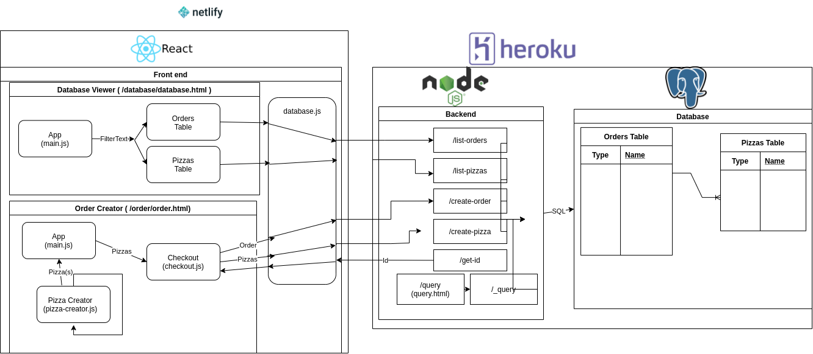

# sdd-pizza

You can find the frontend [here](https://sdd-pizza.netlify.app/) (dosent work on school wifi) and the backend [here](https://pizza-db.herokuapp.com/query)

pizza thing for software class.

Uses client side rendering, where the html is generated dynamically on the client with react.

Uses parcel to bundle my javascript and library javascript together into a single file

run `npm ci` in pizza-app/ to install dependancies

after that run `npx parcel src/index.html` in pizza-app/ to run development server locally

Known issues
 - Negative signs (hyphens) break credit card input

 
